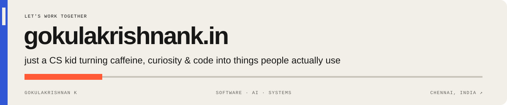

<!-- Generated from profile-content/README.template.md. Run python3 scripts/generate_profile.py after editing. -->

  

  <a href="#selected-work">Selected work</a> &nbsp; / &nbsp;
  <a href="#skills">Skills</a> &nbsp; / &nbsp;
  <a href="#experience">Experience</a> &nbsp; / &nbsp;
  <a href="#contributions">Contributions</a> &nbsp; / &nbsp;
  <a href="https://gokulakrishnank.in">Portfolio ↗</a>

<strong>I build useful things at the intersection of software, intelligence, and the physical world.</strong> From real-time voice agents to offline mesh networks — curious about the whole system.

  <a href="https://gokulakrishnank.in"><strong>gokulakrishnank.in ↗</strong></a> &nbsp; · &nbsp;
  <a href="mailto:gokulakrishnankadhirvelu@gmail.com">Email me ↗</a> &nbsp; · &nbsp;
  <a href="https://github.com/Gokulakrishnan610?tab=repositories">Explore my repositories ↗</a> &nbsp; · &nbsp;
  Chennai, India

---

### A little context

I'm **Gokulakrishnan K**, a **Computer Science & Engineering student at Rajalakshmi Engineering College, Class of 2027**. I work across full-stack applications, backend systems, AI agents, and connected devices.

As **President of DEVS REC**, I help lead a community of **2,500+ tech enthusiasts**, organize initiatives like **DevSprint**, and mentor developers. My approach is simple: understand the problem, build a working solution, and keep improving it.

**Current interests** &nbsp; `Real-time AI` · `RAG & evaluation` · `Distributed systems` · `Edge computing`

## Selected work

<table>
<thead><tr><th align="left">Project</th><th align="left">What it does</th></tr></thead>
<tbody>
<tr>
<td width="30%" valign="top"><strong><a href="https://github.com/Gokulakrishnan610/interviewprep">AI Interview Platform ↗</a></strong> Voice AI</td>
<td valign="top">Practice interviews with real-time voice agents, avatar sessions, evaluation, and feedback.  Next.js · Django · FastAPI · LiveKit</td>
</tr>
<tr>
<td width="30%" valign="top"><strong><a href="https://github.com/Gokulakrishnan610/LMS">ExplifyAI LMS ↗</a></strong> Education</td>
<td valign="top">Video lessons, quizzes, and progress tracking, with a native Android app for students.  React · TypeScript · Django · Kotlin</td>
</tr>
<tr>
<td width="30%" valign="top"><strong><a href="https://github.com/Gokulakrishnan610/MeshTalk">MeshTalk ↗</a></strong> Offline messaging</td>
<td valign="top">Messaging over Bluetooth Low Energy with peer discovery and multi-hop forwarding, without internet infrastructure.  Kotlin · Android · BLE · Cryptography</td>
</tr>
<tr>
<td width="30%" valign="top"><strong><a href="https://github.com/Gokulakrishnan610/esp32cam_feed">ESP32-CAM Feed ↗</a></strong> Connected vision</td>
<td valign="top">Streams frames from multiple ESP32-CAM modules through Flask endpoints and a receiver dashboard.  ESP32-CAM · Python · Flask · OpenCV</td>
</tr>
<tr>
<td width="30%" valign="top"><strong><a href="https://github.com/Gokulakrishnan610/Finalyearproject">AI Answer Evaluation ↗</a></strong> RAG &amp; NLP</td>
<td valign="top">Exploring grounded feedback, criterion-level scoring, and confidence-based escalation for descriptive answers.  RAG · NLP · Explainable AI</td>
</tr>
<tr>
<td width="30%" valign="top"><strong><a href="https://github.com/Gokulakrishnan610/Titanium">Titanium ↗</a></strong> Web &amp; community</td>
<td valign="top">College event website development and technical coordination.  TypeScript · Web applications</td>
</tr>
</tbody>
</table>

<a href="https://github.com/Gokulakrishnan610?tab=repositories">All repositories ↗</a> &nbsp; · &nbsp; <a href="https://gokulakrishnank.in">More on my portfolio ↗</a>

More experiments & campus tools

- **[INSYNC](https://github.com/Gokulakrishnan610/INSYNC)** — software experiments and practical problem solving.
- **[IoT](https://github.com/Gokulakrishnan610/IOT)** — connected-device experiments.
- **Disaster management app** — Flutter and weather-driven emergency prediction.
- **Waste-collecting boat** — computer vision and embedded robotics with YOLO, Raspberry Pi, and Pixhawk.
- **Campus tools** — timetable scheduling and hostel management, developed during my REC internship.

## 🛠️ Skills & tools

**Languages**

**Frontend**

**Backend & databases**

**AI, mobile & IoT**

  
  
  
  
  
  

**Cloud & development**

## Experience

### Firstsource Solutions

Software Engineering Intern · Enterprise Transformation Office · Remote 
December 2025 — April 2026

- Developed AI agents, workflow automation, full-stack features, and backend services.
- Integrated voice and AI tools including ElevenLabs, Deepgram, and Gemini.

### Rajalakshmi Engineering College

Software Developer Intern · Application Development 
April 2025 — November 2025

- Built timetable scheduling and hostel management tools.
- Worked on application development, database design, and campus workflows.

**Community work** — President at **DEVS REC**, organizing **DevSprint**, workshops, and technical events. Technical lead for the **Titanium website team**.

## 🏆 Achievements

| | Competition | Result |
| :---: | :--- | :--- |
| 🥇 | **Smart India Hackathon 2024** | **Winner** |
| 🏅 | **PALS Aquatic Drone Challenge 2025** | Finalist |
| 🏅 | **IIT Kanpur Hackathon** | Top 6 |
| 🥈 | **RAP Hackathon 2025** | **Runner-Up** |
| 🥈 | **Prist University Expo** · State level | 2nd place |
| 🏆 | **IEEE event** | Innovator's Pitch Award |
| 🎯 | **EDII · IIITM Gwalior · Hackmageddon** | Finalist / top finishes |

## 📊 GitHub Statistics

**Recently updated**

- **[LMS](https://github.com/Gokulakrishnan610/LMS)** · TypeScript · pushed 2026-08-21
- **[Finalyearproject](https://github.com/Gokulakrishnan610/Finalyearproject)** · Language not reported · pushed 2026-08-21
- **[interviewprep](https://github.com/Gokulakrishnan610/interviewprep)** · Python · pushed 2026-07-17

## Contributions

### Pac-Man

<picture>
  <source media="(prefers-color-scheme: dark)" srcset="./assets/pacman-dark.svg" />
  <source media="(prefers-color-scheme: light)" srcset="./assets/pacman.svg" />
  
</picture>

<!-- Contribution snake intentionally hidden. Pac-Man remains the active contribution animation.
### Snake

<picture>
  <source media="(prefers-color-scheme: dark)" srcset="./assets/snake.svg" />
  <source media="(prefers-color-scheme: light)" srcset="./assets/snake-light.svg" />
  
</picture>
-->

Updated 19 Sep 2026, 14:45 UTC · Scheduled every 6 hours · <a href="https://github.com/Gokulakrishnan610/Gokulakrishnan610/actions/workflows/profile-refresh.yml">Refresh workflow ↗</a>

Activity details & how the profile updates

**38 original public repositories** · **55 stars received** · **3 followers**. Forks are excluded from repository, star, and language metrics. Language mix counts repositories by their primary language, not code volume or proficiency.

**710 contributions** across **96 active days** · 2025-09-14 → 2026-09-19. The calendar may include anonymized private contributions if enabled on GitHub; no private repository details are fetched.

**Recent public activity**

- 2026-08-21 · Pushed code to [Gokulakrishnan610/LMS](https://github.com/Gokulakrishnan610/LMS)
- 2026-08-21 · Created a repository or ref in [Gokulakrishnan610/LMS](https://github.com/Gokulakrishnan610/LMS)

GitHub schedules and image caches can delay updates. [How this works](./docs/automation.md)

---

## Got a minute?

<a href="https://gokulakrishnank.in">gokulakrishnank.in ↗</a> &nbsp; · &nbsp; <a href="mailto:gokulakrishnankadhirvelu@gmail.com">Email</a> &nbsp; · &nbsp; <a href="https://linkedin.com/in/gokulakrishnan-k-5452962a2">LinkedIn</a>

  

